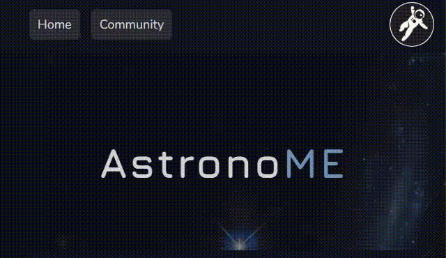
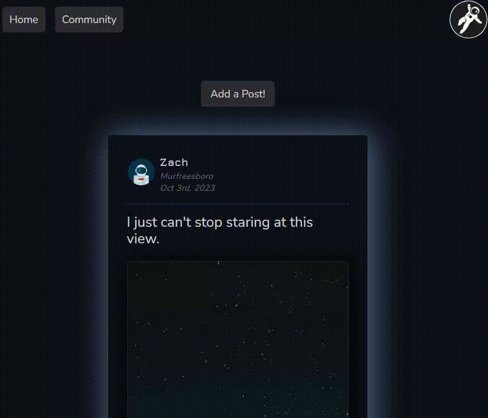

# AstronoME

## Description

AstronoMe is your gateway to the wonders of the universe. Whether you're a seasoned stargazer or just starting your cosmic journey, our website is designed to inform, educate, and inspire your curiosity about the cosmos! Sign in to join the stargazing community and share your adventure onto our community! 

## Table of Contents

- [Installation](#installation)
- [Usage](#usage)
- [Technologies Used](#technologies-used)
- [APIs Used](#apis-used)
- [Credits](#credits)

## Installation

This app is deployed on Heroku: [Click Here](https://dashboard.heroku.com/apps/intense-mesa-16836/)

If you want to deploy this app locally you'll need to do the following:

- Clone the repository to your local machine
- Navigate to the project repository
- Type `npm install` in the terminal to install dependencies
- Type `npm run develop` in the terminal
- Navigate to `http://localhost:3001/` in your browser to get started

## Usage

This app allows users to create an account and view their local weather to determine if it's a good night for stargazing, as well as create forum posts, upload images, and comment on other users posts.

A user can create a new account by clicking the astronaut button at the top right of the viewport. If they already have an account they can instead click 'Login' to do so.

---

Once logged in a user can view current weather conditions, incoming near-earth objects, and a daily image from NASA by viewing the homepage.

---

Users can view other users posts in the community page if logged in, as well as comment on those posts.

---

Users can add a new post by clicking the 'Add a Post!' button at the top of the Community page. They can then enter a body for the post and optionally upload an image using the 'Upload Image' button, then selecting the desired image using the Cloudinary Widget UI.

## Technologies Used

[vitejs/plugin-react](https://www.npmjs.com/package/@vitejs/plugin-react) - Enable Fast Refresh in Development.

[apollo/server](https://www.npmjs.com/package/@apollo/server) - Stand-alone GraphQL server.

[apollo/client](https://www.npmjs.com/package/@apollo/client) - GraphQL client with integrations for React.

[autoprefixer](https://www.npmjs.com/package/autoprefixer) -  PostCSS plugin to parse CSS.

[bcrypt](https://www.npmjs.com/package/bcrypt) - Library to help hash passwords.

[eslint](https://www.npmjs.com/package/eslint) - Tool for identifying issues in code.

[express](https://www.npmjs.com/package/express) - Node.js framework.

[graphql](https://www.npmjs.com/package/graphql) - JavaScript reference implementation for GraphQL.

[graphql-tag](https://www.npmjs.com/package/graphql-tag) - Enables template literal tag for GraphQL query strings.

[jsonwebtoken](https://www.npmjs.com/package/jsonwebtoken) - Used to securely transfer information.

[jwt-decode](https://www.npmjs.com/package/jwt-decode) -  Library to help decode JWTs.

[mongoose](https://www.npmjs.com/package/mongoose) -  MongoDB ODM.

[lunarphase-js](https://www.npmjs.com/package/lunarphase-js) - Calculate phase of the moon using Julian Date.

[postcss](https://www.npmjs.com/package/postcss) - Tool for transforming styles with JS plugins.

[prop-types](https://www.npmjs.com/package/prop-types) - Runtime type checking for React props.

[react](https://www.npmjs.com/package/react) - JavaScript library for creating user interfaces

[react-dom](https://www.npmjs.com/package/react-dom) - Entry point to the DOM for React.

[react-router-dom](https://www.npmjs.com/package/react-router-dom) - Bindings for using React Router.

[tailwindcss](https://www.npmjs.com/package/tailwindcss) - CSS framework.

[vite](https://www.npmjs.com/package/vite) - Local development server for React templates.

## APIs Used

- [OpenWeather Geocoding](https://openweathermap.org/api/geocoding-api) - Used to retrieve latitude and longitude based on user input.

- [OpenWeatherMap](https://openweathermap.org/current) - Used to retrieve current weather conditions based on latitude and longitude input.

- [Astronomy Picture of the Day](https://api.nasa.gov/) - Used to provide a high quality space-related image that changes every day.

- [Asteroids - NeoWs](https://api.nasa.gov/) - Used to retrieve an asteroid that is currently pathing close to Earth.

## Credits

Justin Dong - [dong135790](https://github.com/dong135790)

Zach Gibbs - [Zgibbs58](https://github.com/Zgibbs58)

Christian Gonzales - [cdgonzo23](https://github.com/cdgonzo23)

Chesney Julian - [ChesneyJulian](https://github.com/ChesneyJulian)

Taylor Willis - [t-willis](https://github.com/t-willis)